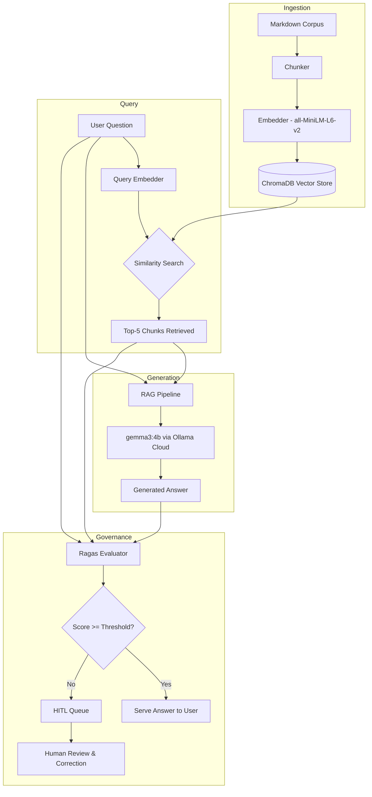
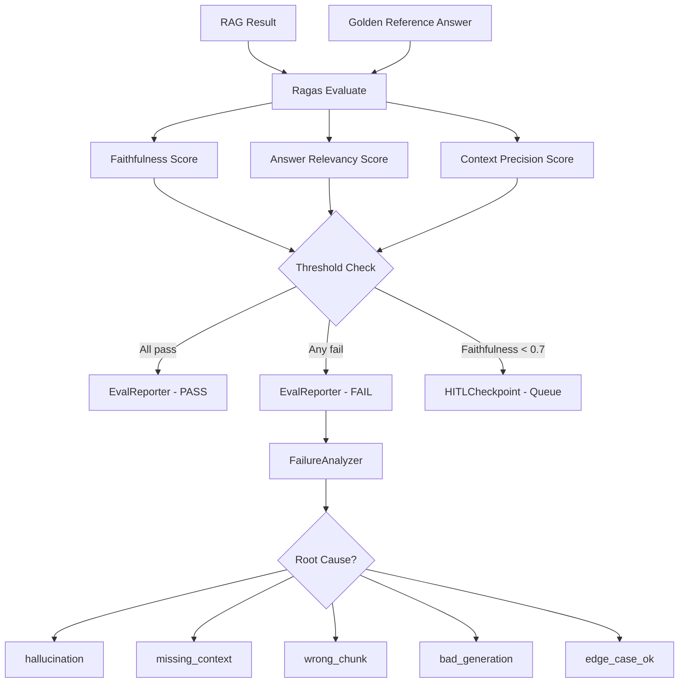
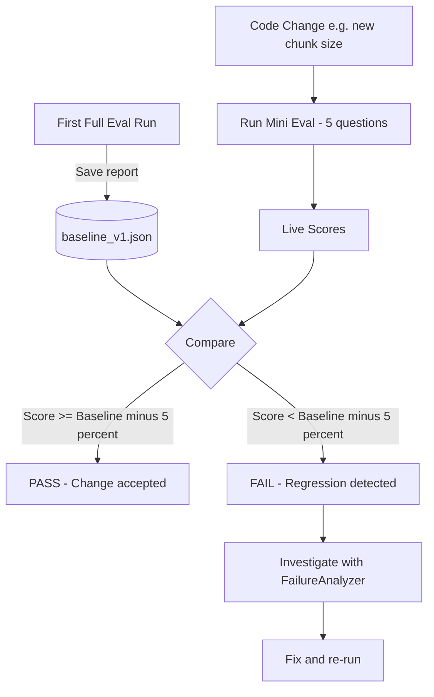
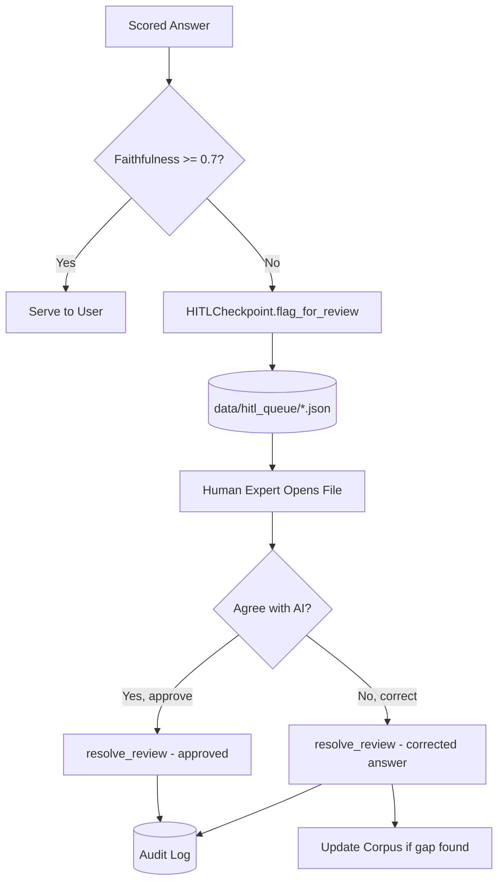
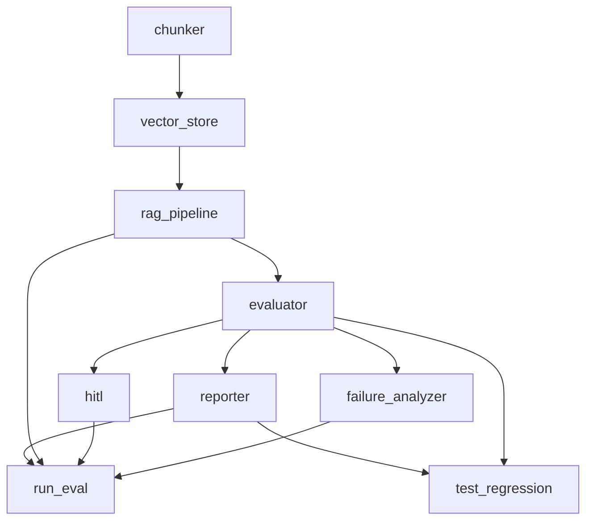

# Architecture — Governed RAG

This document describes the full technical architecture of the Governed RAG system: how components are structured, how data flows through the pipeline, and how the governance layer enforces auditability.

---

## 1. High-Level System Overview

---

## 2. Evaluation Pipeline

Every answer flows through the Ragas triad before being served or flagged.

---

## 3. Regression Testing Flow

This is how we prevent silent performance degradation every time the pipeline changes.

---

## 4. HITL Workflow

---

## 5. Component Dependency Map

---

## 6. Data Flow — Ingestion vs. Query

| Stage | Input | Process | Output |
|---|---|---|---|
| **Ingestion** | `.md` files in `data/docs/` | Chunk → Embed | Vectors in ChromaDB |
| **Query** | User natural language question | Embed → Similarity Search | Top-5 most relevant chunks |
| **Generation** | User question + retrieved chunks | Prompt → LLM call | Natural language answer |
| **Evaluation** | Answer + chunks + reference | Ragas metrics | Scores 0.0–1.0 per metric |
| **Governance** | Scores | Threshold gate | Serve or queue for HITL |
| **Regression** | Live scores vs. baseline | Statistical comparison | Pass or regression alert |

---

## 7. Key Design Decisions

| Decision | Chosen Approach | Trade-off |
|---|---|---|
| **Embedding model** | Local `all-MiniLM-L6-v2` via PyTorch | No API cost or network dependency; less powerful than commercial models |
| **Vector store** | ChromaDB (local SQLite) | Zero infrastructure setup; not horizontally scalable |
| **Generation model** | `gemma3:4b` via Ollama Cloud | Compact and fast; larger models would improve answer quality |
| **Judge model** | `ministral-3:8b` via Ollama Cloud | Available on current cloud instance; GPT-4 class would grade more accurately |
| **HITL storage** | JSON files in `data/hitl_queue/` | Fully transparent and debuggable; not integrated with enterprise ticketing |
| **Eval framework** | Ragas with LangChain wrappers | Best-in-class RAG metrics; required careful bridging due to version changes |
